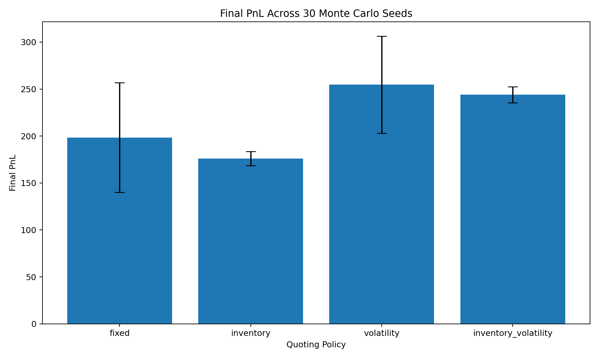
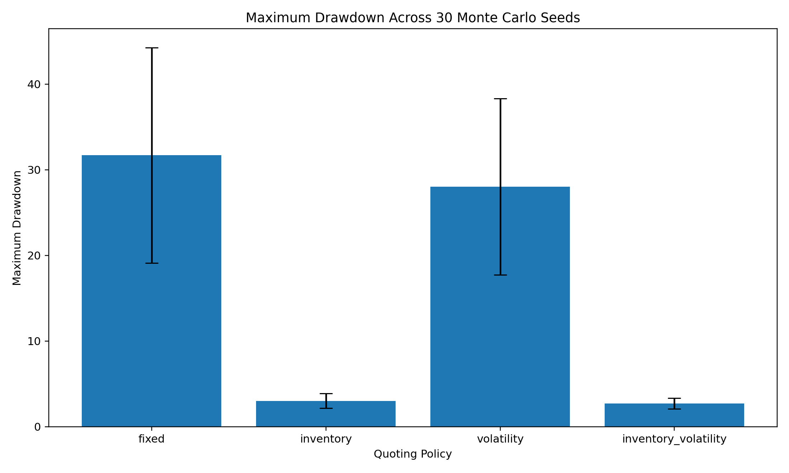
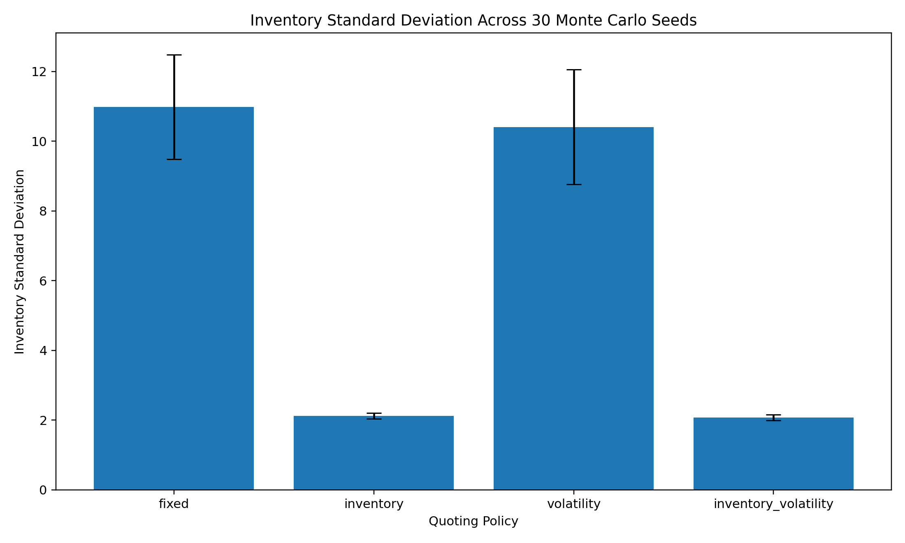
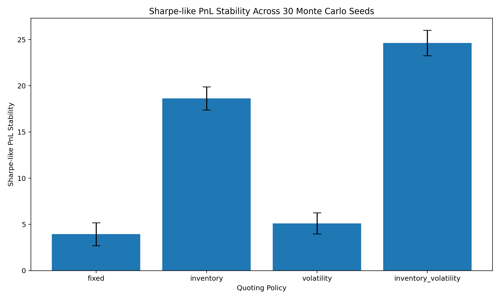

# Event-Driven Market Maker

A reproducible market-making simulation project that studies how different quote-setting strategies balance profit, inventory risk, drawdown, and adverse selection.

## Overview

Market makers continuously post buy prices (**bids**) and sell prices (**asks**) around a market price. They earn spread revenue when trades occur, but they can lose money if they accumulate too much inventory or trade against better-informed participants.

This project builds a stylized event-driven market simulator to study that trade-off. It simulates price movements, incoming buy and sell orders, fills, transaction costs, inventory limits, and adverse-selection effects.

The simulator uses **synthetic Monte Carlo market data**, not historical order-book data. Each experiment generates many randomized market paths under controlled assumptions.

## What the Simulator Models

At every simulated event:

1. The mid-price changes according to a stochastic price process.
2. A buy order, sell order, or no order may arrive.
3. The market maker posts bid and ask quotes.
4. Quotes closer to the market price are more likely to fill.
5. Fills change the market maker's inventory and cash balance.
6. Inventory, PnL, drawdown, fill count, and adverse-selection costs are recorded.

The simulator includes:

* Stochastic mid-price dynamics
* Random buy and sell market-order arrivals
* Informed order flow aligned with future price movements
* Quote-dependent fill probabilities
* Transaction costs
* Inventory limits and inventory penalties
* Mark-to-market PnL accounting
* Multi-seed Monte Carlo evaluation
* Python research workflow and C++ event-loop benchmark

## Quoting Policies

The project compares four policies:

* **Fixed Spread**
  Posts a constant bid-ask spread around the current mid-price.

* **Inventory Skew**
  Adjusts quotes based on current inventory. For example, when the market maker owns too much inventory, it shifts quotes downward to encourage selling and discourage additional buying.

* **Volatility Aware**
  Widens spreads when market volatility is higher, reducing the chance of being adversely selected.

* **Inventory + Volatility**
  Combines inventory-aware quote skew with volatility-aware spread widening.

## Main Findings

The policies were evaluated across **30 Monte Carlo seeds**, each representing a different simulated market path.

| Policy                 | Mean Final PnL | PnL Std. Dev. | Mean Drawdown | Inventory Std. Dev. | Sharpe-like Stability |
| ---------------------- | -------------: | ------------: | ------------: | ------------------: | --------------------: |
| Fixed Spread           |         198.33 |         58.36 |         31.69 |               10.99 |                  3.95 |
| Inventory Skew         |         175.94 |          7.48 |          3.02 |                2.12 |                 18.63 |
| Volatility Aware       |         254.69 |         51.71 |         28.02 |               10.41 |                  5.11 |
| Inventory + Volatility |         243.93 |          8.45 |          2.70 |                2.07 |                 24.64 |

### Interpretation

The **Volatility Aware** policy produced the highest average raw PnL.

However, the **Inventory + Volatility** policy produced the strongest risk-adjusted outcome:

* Retained approximately **96%** of volatility-only mean PnL.
* Reduced mean maximum drawdown by approximately **90%**.
* Reduced inventory volatility by approximately **80%**.
* Reduced cross-run PnL variability by approximately **84%**.
* Achieved the highest Sharpe-like stability metric: **24.64**.

This result illustrates a central market-making trade-off: maximizing raw PnL is not necessarily the same as maximizing stable, risk-controlled PnL.

## Results

### Mean PnL Across 30 Monte Carlo Seeds



### Maximum Drawdown



### Inventory Risk



### Sharpe-like PnL Stability



## Repository Structure

```text
Event-Driven-Market-Maker/
├── cpp/
│   ├── CMakeLists.txt
│   └── src/
│       └── benchmark.cpp
├── python/
│   ├── simulator.py
│   ├── run_experiment.py
│   ├── run_multiseed.py
│   ├── plot_multiseed.py
│   └── benchmark_python.py
├── results/
│   ├── policy_summary.csv
│   ├── multiseed_policy_results.csv
│   ├── multiseed_policy_summary.csv
│   ├── multiseed_pnl_errorbars.png
│   ├── multiseed_drawdown_errorbars.png
│   ├── multiseed_inventory_risk_errorbars.png
│   └── multiseed_sharpe_errorbars.png
├── requirements.txt
└── README.md
```

## How to Run

Install Python dependencies:

```bash
python3 -m pip install -r requirements.txt
```

Run one simulated market path for each policy:

```bash
python3 python/run_experiment.py
```

Run the multi-seed evaluation:

```bash
python3 python/run_multiseed.py
```

Generate the result figures:

```bash
python3 python/plot_multiseed.py
```

## C++ Benchmark

The repository also includes a C++17 implementation of the core event-processing loop for performance experimentation.

Build and run it with:

```bash
cmake -S cpp -B cpp/build -DCMAKE_BUILD_TYPE=Release
cmake --build cpp/build
./cpp/build/market_making_benchmark 200000
```

The C++ benchmark is currently compute-focused, while the Python simulation saves full event histories for analysis. Therefore, the timing comparison should be interpreted as a workflow benchmark rather than a perfectly matched language benchmark.

## Limitations

This is a research and educational simulator, not a production trading system. It does not yet model:

* Full exchange limit-order-book depth
* Queue position and price-time priority
* Partial fills and variable order sizes
* Latency races and quote-cancellation delays
* Historical quote or trade replay
* Real exchange connectivity

## Future Work

* Add order-book queue dynamics and partial fills.
* Model clustered order flow with Hawkes-process-style arrivals.
* Add latency-aware quote updates and cancellations.
* Build a matched Python compute-only benchmark for fairer C++ comparisons.
* Evaluate policies on historical quote and trade data.
